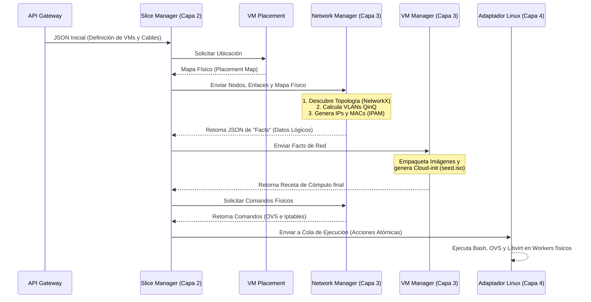

# Arquitectura y Lógica Core del Network Manager

El Network Manager es el módulo de Capa 3 del orquestador encargado de resolver toda la conectividad, segmentación, direccionamiento y reglas de acceso (L2 y L3) entre las Máquinas Virtuales (VMs) de un Slice. 

Este documento explica a profundidad cómo se diseñó la lógica interna para cumplir con los requerimientos del proyecto, los escenarios de validación y su interacción con el resto de la arquitectura.

---

## 1. Descripción de los Archivos del Módulo

Para asegurar la mantenibilidad y modularidad, el código está dividido en los siguientes archivos clave:

*   **`config.py`**: Centraliza todas las variables de entorno, subredes, IPs por defecto (como `10.0.10.0/24` para gestión y `10.60.5.0/24` para internet). Evita tener valores "quemados" (hardcodeados) en el código.
*   **`schemas.py`**: Define los contratos de entrada y salida utilizando Pydantic. Garantiza que cualquier JSON que entre o salga del módulo tenga la estructura y tipos de datos correctos.
*   **`topology_engine.py`**: Es el motor matemático. Utiliza la librería `NetworkX` para ingerir la lista de enlaces de los usuarios y dictaminar automáticamente el tipo de topología (Anillo, Estrella, Malla Parcial). También identifica qué nodos tienen salida a internet.
*   **`vlan_manager.py`**: Administra la reserva concurrente (Thread-Safe) de las etiquetas VLAN. Asigna el S-TAG exterior (para el Slice) y los C-TAGs interiores (para aislar cada cable).
*   **`ipam.py`**: El Gestor de Direcciones IP. Reemplaza matemáticamente la necesidad de usar servidores DHCP cortando subredes estáticas `/30` para los enlaces privados y otorgando IPs públicas (`10.60.5.X`) para el internet. También genera las direcciones MAC únicas.
*   **`ovs_generator.py`**: El traductor de infraestructura. Toma los datos calculados y escupe las líneas exactas de comandos de Bash, Open vSwitch e Iptables requeridas para que los servidores físicos construyan la red.
*   **`action_handler.py`**: Actúa como el adaptador (Adapter Pattern) para comunicarse con el flujo de trabajo de Temporal, respondiendo a peticiones atómicas (`ATTACH_PORT`, `CREATE_LINK`, `SET_PUBLIC`).
*   **`main.py`**: El punto de entrada principal (API FastAPI). Expone los endpoints REST que consumen el Slice Manager y otros componentes.

---

## 2. Flujo de Interacción con Otros Módulos (Coreografía)

El Network Manager no opera de forma aislada. Funciona como el "cerebro de redes" que procesa peticiones del orquestador y entrega datos para los siguientes eslabones de la cadena.



---

## 3. Lógica de Segmentación y Aislamiento L2 (Cumplimiento de R5)

El principal desafío del proyecto es aislar el tráfico de capa 2 (broadcast, ARP) entre distintos Slices, e incluso aislar los diferentes enlaces privados dentro de un mismo Slice.

Para lograr esto, el Network Manager implementa QinQ (Doble Etiquetado VLAN / dot1q-tunneling) usando Open vSwitch (OVS).

### A. Asignación de Etiquetas (Tags)
1. S-TAG (vlan_slice): Es la etiqueta exterior. Se asigna una de forma exclusiva por Slice (Rango 100-1000). Sirve para que el tráfico viaje de forma segura por la red física (OpenFlow Switch - OFS) sin mezclarse con Slices de otros usuarios.
2. C-TAG (vlan_inner): Es la etiqueta interior. Se asigna una distinta por cada enlace punto a punto dentro del Slice (Inicia en 10, 20, 30...). 

### B. Análisis de Ubicación Física (is_remote)
El orquestador envía el mapa de ubicación (Placement) de las VMs. El Network Manager analiza cada enlace matemáticamente:
* Enlace Local (is_remote = False): Ambas VMs residen en el mismo Worker. Solo necesitan conectarse al puente local (br-sl-{id}) usando su C-TAG. El tráfico nunca sale al exterior físico.
* Enlace Remoto (is_remote = True): Las VMs están en distintos Workers. El Network Manager genera comandos para crear un par veth. Un extremo va al puente del slice y el otro al puente troncal (br-wk). En el puerto del puente físico, se configura el modo dot1q-tunnel, empaquetando el C-TAG dentro del S-TAG para cruzar el Switch OFS.

Ventaja Operativa: Al otorgar a cada cable privado su propio C-TAG, los dominios de colisión quedan estrictamente aislados. Si una VM lanza una solicitud ARP por una de sus interfaces, el switch virtual restringirá el paquete de broadcast para que solo llegue a la VM destino de ese cable específico.

---

## 4. Gestión de Direccionamiento IP (IPAM vs DHCP)

Para los enlaces privados L2, la rúbrica exige asignación de direccionamiento IP. Una solución común es desplegar servidores DHCP (ej. dnsmasq) confinados en Network Namespaces por cada enlace. Sin embargo, esto impacta severamente los recursos del nodo físico y aumenta la tasa de fallos.

Nuestra Solución (IPAM Estático + Cloud-Init):
El Network Manager incluye un módulo centralizado de IP Address Management (IPAM) que elimina por completo la necesidad de un servidor DHCP en los enlaces privados.

* Para cada enlace privado, el IPAM secciona matemáticamente una subred /30 (4 direcciones IP) a partir de una base principal (ej. 192.168.1.0/24).
* El enlace 1 recibe la subred 192.168.1.0/30. A la primera VM se le asigna la .1 y a la segunda la .2.
* Estas direcciones IP se retornan al Orquestador como Datos Lógicos ("Facts"). Posteriormente, el VM Manager inyecta estos datos de forma declarativa dentro del archivo de configuración inicial de la máquina (seed.iso). Cuando la máquina virtual arranca, el sistema operativo lee el CD-ROM virtual y autoconfigura sus interfaces de red inmediatamente.

---

## 5. Lógica L3: Enrutamiento, NAT e Iptables en el Gateway

Para las VMs declaradas con salida a internet, el Network Manager centraliza el flujo de salida hacia un Gateway (Server 4). 

1. Puente Dedicado: Las interfaces con salida pública se conectan a un puente especial llamado br-inet, el cual no posee encapsulación VLAN.
2. Direccionamiento Público G3: El IPAM asigna IPs dentro del rango oficial del grupo (10.60.5.0/24) y configura el Default Gateway hacia 10.60.5.1.
3. Comandos Generados para el Gateway:
   * Habilitar Enrutamiento (ip_forward=1): Instruye al kernel de Linux del nodo Gateway para que actúe como un enrutador, permitiendo el reenvío de paquetes entre sus tarjetas de red.
   * NAT de Salida (MASQUERADE): Regla en la tabla nat de iptables. Cuando una VM intenta alcanzar internet, esta regla intercepta el tráfico, enmascara la IP privada (ej. 10.60.5.10) y la reemplaza temporalmente por la IP pública del Gateway.
   * Aislamiento (Bloqueo de Gestión): Regla DROP en la cadena FORWARD. Bloquea explícitamente el tráfico originado en la red 10.60.5.0/24 que intente dirigirse a la red de administración física de los workers (10.0.10.0/24). Previene ataques a la infraestructura.
   * Redirección Entrante (DNAT): Regla PREROUTING para conexiones VPN. Si un usuario accede vía SSH a un puerto específico de la IP pública del Gateway, el paquete es alterado a nivel destino (Destination NAT) para ser entregado directamente al puerto 22 de la IP interna de la máquina virtual correspondiente.

---

## 6. Estructuras JSON y Contratos de Interfaz

A continuación se exponen los payloads JSON completos y sin simplificar de las peticiones para la topología base del Examen (6 VMs, con conexiones públicas en VM1 y VM3).

### 6.1. Fase de Datos Lógicos (Facts)

El Orquestador envía un requerimiento de reserva de red (`AllocateRequest`) detallando los enlaces y el mapa de ubicación física (Placement). 

**JSON de Entrada Completo (`AllocateRequest`):**
```json
{
  "slice_id": 1,
  "placement_map": {
    "VM1": "Worker1",
    "VM2": "Worker2",
    "VM3": "Worker3",
    "VM4": "Worker1",
    "VM5": "Worker2",
    "VM6": "Worker3",
    "INTERNET": "Gateway"
  },
  "links": [
    {"link_name": "L1", "vm_a_id": "VM1", "iface_a": "eth1", "vm_b_id": "VM2", "iface_b": "eth1"},
    {"link_name": "L2", "vm_a_id": "VM2", "iface_a": "eth2", "vm_b_id": "VM3", "iface_b": "eth1"},
    {"link_name": "L3", "vm_a_id": "VM3", "iface_a": "eth2", "vm_b_id": "VM4", "iface_b": "eth1"},
    {"link_name": "L4", "vm_a_id": "VM4", "iface_a": "eth2", "vm_b_id": "VM1", "iface_b": "eth2"},
    {"link_name": "L5", "vm_a_id": "VM4", "iface_a": "eth3", "vm_b_id": "VM5", "iface_b": "eth1"},
    {"link_name": "L6", "vm_a_id": "VM5", "iface_a": "eth2", "vm_b_id": "VM6", "iface_b": "eth1"},
    {"link_name": "L7_PUB", "vm_a_id": "VM1", "iface_a": "eth0", "vm_b_id": "INTERNET", "iface_b": "eth0"},
    {"link_name": "L8_PUB", "vm_a_id": "VM3", "iface_a": "eth0", "vm_b_id": "INTERNET", "iface_b": "eth0"}
  ]
}
```

El Network Manager responde con la asignación matemática y estructural:

**JSON de Salida Completo (`AllocateResponse`):**
```json
{
  "slice_id": 1,
  "vlan_slice": 100,
  "bridge_name": "br-sl-1",
  "topology_type": null,
  "networks": [
    {
      "network_id": 1,
      "id": 1,
      "link_name": "L1",
      "vlan_inner": 100,
      "is_remote": true,
      "subnet_cidr": "192.168.1.0/30",
      "interfaces": [
        {
          "vm_id": "VM1",
          "interface_name": "eth1",
          "tap_name": "tap-vmVM1-eth1",
          "mac_address": "52:54:00:73:50:bd",
          "ip_address": "192.168.1.1",
          "bridge_name": "br-sl-1",
          "worker_id": "Worker1"
        },
        {
          "vm_id": "VM2",
          "interface_name": "eth1",
          "tap_name": "tap-vmVM2-eth1",
          "mac_address": "52:54:00:5f:57:02",
          "ip_address": "192.168.1.2",
          "bridge_name": "br-sl-1",
          "worker_id": "Worker2"
        }
      ]
    },
    {
      "network_id": 2,
      "id": 2,
      "link_name": "L2",
      "vlan_inner": 200,
      "is_remote": true,
      "subnet_cidr": "192.168.1.4/30",
      "interfaces": [
        {
          "vm_id": "VM2",
          "interface_name": "eth2",
          "tap_name": "tap-vmVM2-eth2",
          "mac_address": "52:54:00:04:8d:eb",
          "ip_address": "192.168.1.5",
          "bridge_name": "br-sl-1",
          "worker_id": "Worker2"
        },
        {
          "vm_id": "VM3",
          "interface_name": "eth1",
          "tap_name": "tap-vmVM3-eth1",
          "mac_address": "52:54:00:78:95:97",
          "ip_address": "192.168.1.6",
          "bridge_name": "br-sl-1",
          "worker_id": "Worker3"
        }
      ]
    },
    {
      "network_id": 3,
      "id": 3,
      "link_name": "L3",
      "vlan_inner": 300,
      "is_remote": true,
      "subnet_cidr": "192.168.1.8/30",
      "interfaces": [
        {
          "vm_id": "VM3",
          "interface_name": "eth2",
          "tap_name": "tap-vmVM3-eth2",
          "mac_address": "52:54:00:76:2f:a0",
          "ip_address": "192.168.1.9",
          "bridge_name": "br-sl-1",
          "worker_id": "Worker3"
        },
        {
          "vm_id": "VM4",
          "interface_name": "eth1",
          "tap_name": "tap-vmVM4-eth1",
          "mac_address": "52:54:00:2b:3c:e6",
          "ip_address": "192.168.1.10",
          "bridge_name": "br-sl-1",
          "worker_id": "Worker1"
        }
      ]
    },
    {
      "network_id": 4,
      "id": 4,
      "link_name": "L4",
      "vlan_inner": 400,
      "is_remote": false,
      "subnet_cidr": "192.168.1.12/30",
      "interfaces": [
        {
          "vm_id": "VM4",
          "interface_name": "eth2",
          "tap_name": "tap-vmVM4-eth2",
          "mac_address": "52:54:00:16:d2:4e",
          "ip_address": "192.168.1.13",
          "bridge_name": "br-sl-1",
          "worker_id": "Worker1"
        },
        {
          "vm_id": "VM1",
          "interface_name": "eth2",
          "tap_name": "tap-vmVM1-eth2",
          "mac_address": "52:54:00:1a:25:ea",
          "ip_address": "192.168.1.14",
          "bridge_name": "br-sl-1",
          "worker_id": "Worker1"
        }
      ]
    },
    {
      "network_id": 5,
      "id": 5,
      "link_name": "L5",
      "vlan_inner": 500,
      "is_remote": true,
      "subnet_cidr": "192.168.1.16/30",
      "interfaces": [
        {
          "vm_id": "VM4",
          "interface_name": "eth3",
          "tap_name": "tap-vmVM4-eth3",
          "mac_address": "52:54:00:44:03:62",
          "ip_address": "192.168.1.17",
          "bridge_name": "br-sl-1",
          "worker_id": "Worker1"
        },
        {
          "vm_id": "VM5",
          "interface_name": "eth1",
          "tap_name": "tap-vmVM5-eth1",
          "mac_address": "52:54:00:16:fa:d4",
          "ip_address": "192.168.1.18",
          "bridge_name": "br-sl-1",
          "worker_id": "Worker2"
        }
      ]
    },
    {
      "network_id": 6,
      "id": 6,
      "link_name": "L6",
      "vlan_inner": 600,
      "is_remote": true,
      "subnet_cidr": "192.168.1.20/30",
      "interfaces": [
        {
          "vm_id": "VM5",
          "interface_name": "eth2",
          "tap_name": "tap-vmVM5-eth2",
          "mac_address": "52:54:00:63:dd:8d",
          "ip_address": "192.168.1.21",
          "bridge_name": "br-sl-1",
          "worker_id": "Worker2"
        },
        {
          "vm_id": "VM6",
          "interface_name": "eth1",
          "tap_name": "tap-vmVM6-eth1",
          "mac_address": "52:54:00:71:c5:92",
          "ip_address": "192.168.1.22",
          "bridge_name": "br-sl-1",
          "worker_id": "Worker3"
        }
      ]
    },
    {
      "network_id": 7,
      "id": 7,
      "link_name": "L7_PUB",
      "vlan_inner": 0,
      "is_remote": false,
      "subnet_cidr": "10.60.5.0/24",
      "interfaces": [
        {
          "vm_id": "VM1",
          "interface_name": "eth0",
          "tap_name": "tap-vmVM1-eth0",
          "mac_address": "52:54:00:22:a0:a9",
          "ip_address": "10.60.5.10",
          "bridge_name": "br-inet",
          "worker_id": "Worker1"
        }
      ]
    },
    {
      "network_id": 8,
      "id": 8,
      "link_name": "L8_PUB",
      "vlan_inner": 0,
      "is_remote": false,
      "subnet_cidr": "10.60.5.0/24",
      "interfaces": [
        {
          "vm_id": "VM3",
          "interface_name": "eth0",
          "tap_name": "tap-vmVM3-eth0",
          "mac_address": "52:54:00:72:ef:19",
          "ip_address": "10.60.5.11",
          "bridge_name": "br-inet",
          "worker_id": "Worker3"
        }
      ]
    }
  ]
}
```

### 6.2. Fase de Comandos Físicos (Generación OVS)

Para materializar las estructuras previas, el Network Manager entrega un JSON final con las instrucciones de línea de comandos, diseñado para que el Adaptador Linux las ejecute sin necesidad de inferir lógica de redes.

**JSON de Salida Completo (`OvsCommandResponse`):**

```json
{
  "slice_id": 1,
  "vlan_slice": 100,
  "bridge_name": "br-sl-1",
  "workers": [
    {
      "worker_id": 1,
      "commands": [
        "sudo ovs-vsctl --may-exist add-br br-sl-1",
        "sudo ovs-vsctl --may-exist add-br br-provider",
        "sudo ovs-vsctl --may-exist add-port br-provider ens4",
        "sudo ovs-vsctl set port ens4 vlan_mode=trunk",
        "sudo ip tuntap add tap-vm1-eth0 mode tap 2>/dev/null || true",
        "sudo ip link set tap-vm1-eth0 up",
        "sudo ovs-vsctl --may-exist add-port br-sl-1 tap-vm1-eth0 tag=100",
        "sudo ip link add veth-sl-1 type veth peer name veth-wk-1 2>/dev/null || true",
        "sudo ip link set veth-sl-1 up",
        "sudo ip link set veth-wk-1 up",
        "sudo ovs-vsctl --may-exist add-port br-sl-1 veth-sl-1 -- set port veth-sl-1 vlan_mode=trunk",
        "sudo ovs-vsctl --may-exist add-port br-provider veth-wk-1 -- set port veth-wk-1 vlan_mode=dot1q-tunnel tag=100 other_config:qinq-ethtype=802.1q"
      ]
    },
    {
      "worker_id": 2,
      "commands": [
        "sudo ovs-vsctl --may-exist add-br br-sl-1",
        "sudo ovs-vsctl --may-exist add-br br-provider",
        "sudo ovs-vsctl --may-exist add-port br-provider ens4",
        "sudo ovs-vsctl set port ens4 vlan_mode=trunk",
        "sudo ip tuntap add tap-vm2-eth0 mode tap 2>/dev/null || true",
        "sudo ip link set tap-vm2-eth0 up",
        "sudo ovs-vsctl --may-exist add-port br-sl-1 tap-vm2-eth0 tag=200",
        "sudo ip link add veth-sl-1 type veth peer name veth-wk-1 2>/dev/null || true",
        "sudo ip link set veth-sl-1 up",
        "sudo ip link set veth-wk-1 up",
        "sudo ovs-vsctl --may-exist add-port br-sl-1 veth-sl-1 -- set port veth-sl-1 vlan_mode=trunk",
        "sudo ovs-vsctl --may-exist add-port br-provider veth-wk-1 -- set port veth-wk-1 vlan_mode=dot1q-tunnel tag=100 other_config:qinq-ethtype=802.1q"
      ]
    },
    {
      "worker_id": 3,
      "commands": [
        "sudo ovs-vsctl --may-exist add-br br-sl-1",
        "sudo ovs-vsctl --may-exist add-br br-provider",
        "sudo ovs-vsctl --may-exist add-port br-provider ens4",
        "sudo ovs-vsctl set port ens4 vlan_mode=trunk",
        "sudo ip tuntap add tap-vm3-eth0 mode tap 2>/dev/null || true",
        "sudo ip link set tap-vm3-eth0 up",
        "sudo ovs-vsctl --may-exist add-port br-sl-1 tap-vm3-eth0 tag=300",
        "sudo ip link add veth-sl-1 type veth peer name veth-wk-1 2>/dev/null || true",
        "sudo ip link set veth-sl-1 up",
        "sudo ip link set veth-wk-1 up",
        "sudo ovs-vsctl --may-exist add-port br-sl-1 veth-sl-1 -- set port veth-sl-1 vlan_mode=trunk",
        "sudo ovs-vsctl --may-exist add-port br-provider veth-wk-1 -- set port veth-wk-1 vlan_mode=dot1q-tunnel tag=100 other_config:qinq-ethtype=802.1q"
      ]
    }
  ],
  "gateway_commands": [
    "sudo ovs-vsctl --may-exist add-br br-inet",
    "sudo ip addr add 10.60.5.1/24 dev br-inet 2>/dev/null || true",
    "sudo ip link set br-inet up",
    "sudo sysctl -w net.ipv4.ip_forward=1",
    "sudo iptables -t nat -C POSTROUTING -s 10.60.5.0/24 -o ens3 -j MASQUERADE 2>/dev/null || sudo iptables -t nat -A POSTROUTING -s 10.60.5.0/24 -o ens3 -j MASQUERADE",
    "sudo iptables -C FORWARD -s 10.60.5.0/24 -d 10.0.10.0/24 -j DROP 2>/dev/null || sudo iptables -I FORWARD 1 -s 10.60.5.0/24 -d 10.0.10.0/24 -j DROP",
    "sudo iptables -C FORWARD -s 10.60.5.0/24 -j ACCEPT 2>/dev/null || sudo iptables -A FORWARD -s 10.60.5.0/24 -j ACCEPT",
    "sudo iptables -C FORWARD -d 10.60.5.0/24 -j ACCEPT 2>/dev/null || sudo iptables -A FORWARD -d 10.60.5.0/24 -j ACCEPT",
    "sudo iptables -t nat -C PREROUTING -i ens3 -p tcp --dport 5001 -j DNAT --to-destination 10.60.5.11:22 2>/dev/null || sudo iptables -t nat -A PREROUTING -i ens3 -p tcp --dport 5001 -j DNAT --to-destination 10.60.5.11:22"
  ]
}
```

Al separar la lógica en Datos Lógicos y Comandos Físicos, el sistema garantiza una orquestación escalable, libre de dependencias complejas en los servidores subyacentes.
