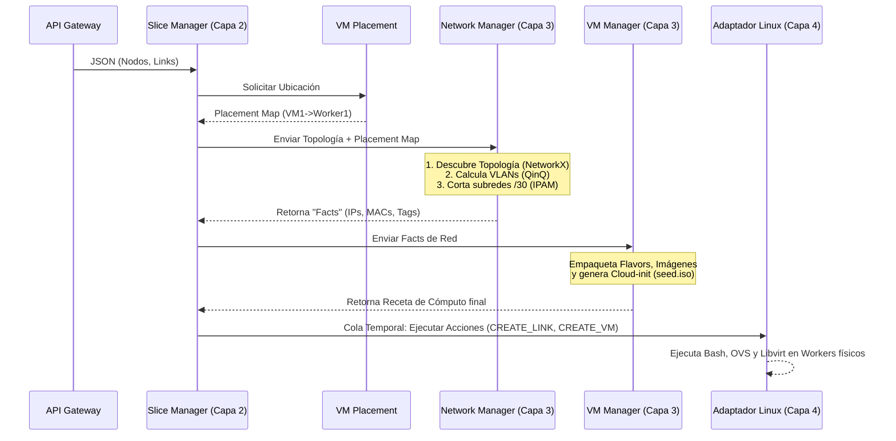

# Arquitectura y Lógica Core del Network Manager

El **Network Manager** es el módulo de Capa 3 del orquestador encargado de resolver toda la conectividad, segmentación, direccionamiento y reglas de acceso entre las Máquinas Virtuales (VMs) de un Slice. 

Este documento explica de forma explícita cómo se diseñó la lógica interna para cumplir con el Requerimiento 5 (R5), los casos de prueba del examen (EX1) y su interacción con el resto del sistema.

---

## 1. Lógica de Segmentación y Aislamiento L2 (Cumplimiento de R5)
El principal desafío del proyecto (R5) es aislar el tráfico de capa 2 (broadcast, ARP) entre distintos Slices, e incluso aislar los diferentes enlaces privados dentro de un mismo Slice.

Para lograr esto, el Network Manager implementa **QinQ (Doble Etiquetado VLAN / dot1q-tunneling)** usando Open vSwitch (OVS).

### A. Asignación de Etiquetas (Tags)
1. **S-TAG (`vlan_slice`):** Es la etiqueta exterior. Se asigna **una por Slice** (Rango 100-1000). Sirve para que el tráfico viaje de forma segura por la red física (OpenFlow Switch - OFS) sin mezclarse con Slices de otros usuarios.
2. **C-TAG (`vlan_inner`):** Es la etiqueta interior. Se asigna **una por cada cable/enlace punto a punto** dentro del Slice (Inicia en 10, 20, 30...). 

### B. Análisis de Ubicación Físico (`is_remote`)
El orquestador envía el mapa de ubicación (Placement) de las VMs. El Network Manager analiza cada enlace matemáticamente:
*   **Enlace Local (`is_remote = False`):** Ambas VMs están en el mismo Worker. Solo necesitan conectarse al puente local (`br-sl-{id}`) usando su C-TAG. No hay tráfico físico exterior.
*   **Enlace Remoto (`is_remote = True`):** Las VMs están en distintos Workers. El Network Manager genera comandos para crear un par `veth`. Un extremo va al `br-sl-{id}` y el otro al puente físico `br-wk`/`br-provider`. En el puerto del puente físico, se configura el modo `dot1q-tunnel` empaquetando el C-TAG dentro del S-TAG para cruzar el Switch OFS real.

**Ventaja para el EX1:** Al darle a cada cable su propio C-TAG, si la "VM4" lanza un `arping` (broadcast), el switch OVS restringe el paquete para que **solo** llegue a la VM destino de ese cable exacto. Esto aprueba la validación de `tcpdump` del examen.

---

## 2. Gestión de IP (IPAM) vs. DHCP
La rúbrica indica que los enlaces privados (sin salida a internet) deben tener IPs asignadas.
Muchos grupos intentan resolver esto levantando decenas de servidores `dnsmasq` (DHCP) aislados en *Network Namespaces*, lo que satura la memoria del worker y hace la red propensa a fallos.

**Nuestra Solución (IPAM Estático + Cloud-Init):**
El Network Manager incluye un módulo `ipam.py` que reemplaza por completo la necesidad de un servidor DHCP para los enlaces privados.
*   Por cada enlace privado (p. ej. VM1-VM4), el IPAM corta matemáticamente una subred **`/30`** (4 IPs) a partir de un tanque principal (`192.168.1.0/24`).
*   Ejemplo: Enlace 1 obtiene la red `192.168.1.0/30`. A la VM1 se le asigna la `.1` y a la VM4 la `.2`.
*   Estas IPs son devueltas al Orquestador como *Metadata*. Más adelante, el VM Manager inyecta estas IPs directamente en el archivo `seed.iso` (Cloud-init), haciendo que el sistema operativo de la VM se configure automáticamente sin usar DHCP.

---

## 3. Lógica L3: NAT, Gateway y Salida a Internet
Para las VMs declaradas como "Públicas" (ej. VM1 y VM3), el Network Manager activa la **Acción de Red Pública**:

1.  **Puente Dedicado:** Las VMs se conectan a un puente especial llamado `br-inet` (sin VLAN tags, red plana).
2.  **Direccionamiento Oficial G3:** El IPAM les asigna IPs en el rango oficial del grupo: `10.60.5.0/24`, y configura su *Default Gateway* hacia `10.60.5.1`.
3.  **SNAT / MASQUERADE:** El `ovs_generator.py` construye reglas de `iptables` que se ejecutan en el nodo Gateway central (Server 4), habilitando `ip_forward=1` y enmascarando el tráfico hacia internet.
4.  **Aislamiento de Gestión:** El sistema genera una regla `DROP` (`-s 10.60.5.0/24 -d 10.0.10.0/24 -j DROP`) para impedir que los estudiantes hackeen los Workers físicos desde las VMs públicas.
5.  **DNAT (SSH Inbound):** Para permitir que el profesor ingrese desde la VPN a las VMs, se generan reglas `PREROUTING` que redirigen puertos del Gateway hacia el puerto 22 de las VMs.

---

## 4. Flujo de Interacción con Otros Módulos

El Network Manager es llamado **después** del VM Placement y **antes** del VM Manager.



---

## 5. Contrato de Interfaz (Parámetros)

El módulo se comunica nativamente con Temporal mediante un esquema estricto (Pydantic). 

### ENTRADA (Lo que recibe del Slice Manager)
El orquestador envía un Action Payload para crear una conexión (`CREATE_LINK`), adjuntar un puerto (`ATTACH_PORT`) o dar acceso a internet (`SET_PUBLIC`).

**Ejemplo Entrada (`ATTACH_PORT`):**
```json
{
  "action_type": "ATTACH_PORT",
  "slice_id": 1,
  "node_id": "VM1",
  "link_id": "L1_VM1_VM4",
  "placement": {
    "VM1": "Worker1",
    "VM4": "Worker2"
  }
}
```

### SALIDA (Lo que entrega al Slice Manager y al Adaptador)
Devuelve un diccionario de `facts` (Hechos) que contiene la configuración técnica exacta que el Adaptador usará para ejecutar los comandos.

**Ejemplo Salida:**
```json
{
  "status": "SUCCESS",
  "facts": {
    "mac_address": "52:54:00:1a:2b:3c",
    "ip_address": "192.168.1.1/30",
    "vlan_slice": 105,
    "vlan_inner": 10,
    "bridge_name": "br-sl-1",
    "is_remote": true,
    "provider_bridge": "br-wk",
    "ovs_commands": [
      "sudo ovs-vsctl --may-exist add-br br-sl-1",
      "sudo ovs-vsctl add-port br-wk veth-wk-L1 tag=105 vlan_mode=dot1q-tunnel"
    ]
  }
}
```
